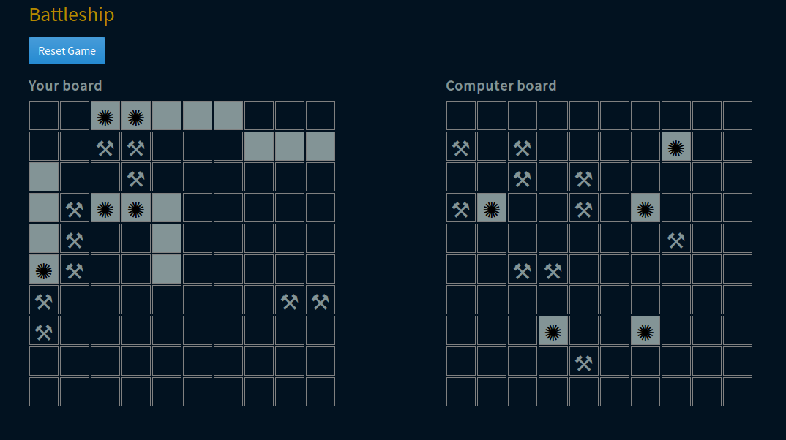

# Battleship

> Battleship is a game played by a human player against the computer. The player attacks the computer by hitting locations on the computer board and vice versa.




The player and computer take turns to attack each other by hitting locations on their opponent's board. If the location holds a ship, the ship is hit. The player who sinks all of the opponents ship first wins the game. 

## Built With

- Javascript
- HTML, CSS
- Webpack
- Jest

## Live Demo

[Live Demo Link](https://rawcdn.githack.com/mosesogwo/Battleship/7d43ca01f344dbe726908d06e60669781d9e55ad/dist/index.html)

## Getting Started

To get a local copy up and running follow these simple example steps.

 - Clone this repository to your local machine using ```git clone git@github.com:mosesogwo/Battleship.git```.

 - Run ```cd battleship``` to move into the app directory.

 - Open the ```dist/index.html``` file in your browser.


## Authors

👤 **Moses Ogwo**

- Github: [@mosesogwo](https://github.com/mosesogwo)

👤 **Daniel Mitiku**

- Github: [@danielmitiku](https://github.com/DanielMitiku)


## 📝 License

This project is [MIT](http://www.tldrlegal.com/license/mit-license) licensed.
